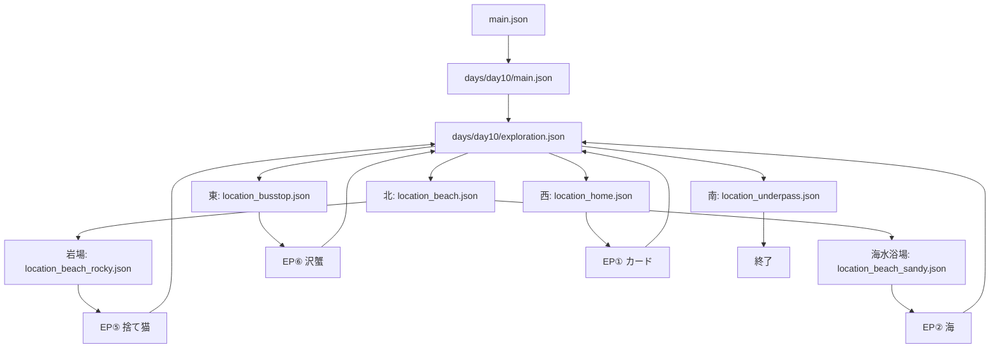

# キミノコエ
失った記憶を、声で辿るアドベンチャー＆ノベルゲーム。

## 関連

- [公式サイト](https://azukigame-s.github.io/website/)

## シナリオフロー

### 全体構造

### ファイル構成

| 日本語名 | ファイルパス |
|---------|------------|
| **メインシナリオ** | |
| ゲーム開始、回想シーン、10月10日の導入 | `scenarios/main.json` |
| 10月10日のメインストーリー | `scenarios/days/day10/main.json` |
| 10月10日の探索パート（選択肢） | `scenarios/days/day10/exploration.json` |
| **分岐シナリオ（10月10日）** | |
| 海への分岐 | `scenarios/branches/day10/location_beach.json` |
| 　岩場（EP⑤ 捨て猫へ） | `scenarios/branches/day10/location_beach_rocky.json` |
| 　海水浴場（EP② 海へ） | `scenarios/branches/day10/location_beach_sandy.json` |
| 湧き水（EP⑥ 沢蟹へ） | `scenarios/branches/day10/location_busstop.json` |
| お寺（終了） | `scenarios/branches/day10/location_underpass.json` |
| バス停（EP① カードへ） | `scenarios/branches/day10/location_home.json` |
| **エピソード** | |
| EP① カード | `scenarios/episodes/episode_01.json` |
| EP② 海 | `scenarios/episodes/episode_02.json` |
| EP⑤ 捨て猫 | `scenarios/episodes/episode_05.json` |
| EP⑥ 沢蟹 | `scenarios/episodes/episode_06.json` |

### フロー詳細

#### 1. ゲーム開始

`main.json` → 回想シーン（flashback_start ~ flashback_end） → `days/day10/main.json`

#### 2. 10月10日メイン

`days/day10/main.json` → バス停、地下道、実家のシーン → `days/day10/exploration.json`

#### 3. 探索パート

`days/day10/exploration.json` で4つの選択肢：
- **北（海の方）**: `location_beach.json`
  - さらに2つの選択肢：
    - 岩場がある右に進む → `location_beach_rocky.json` → EP⑤
    - 海水浴場がある左に進む → `location_beach_sandy.json` → EP②
- **東（湧き水の方）**: `location_busstop.json` → EP⑥
- **南（お寺の方）**: `location_underpass.json`（終了、エピソードなし）
- **西（バス停の方）**: `location_home.json` → EP①

#### 4. エピソード終了後

各エピソード終了後は `scenario_stack` により `exploration.json` に戻る。

### 注意事項

- エピソードファイルは `load_scenario` で読み込まれ、`new_page_after_return: true` により終了後に元のシナリオに戻る
- エピソードクリア時は `episode_clear` コマンドでトロフィーが獲得される
- スキップ機能（Ctrl長押し2秒）で選択肢まで自動進行可能

