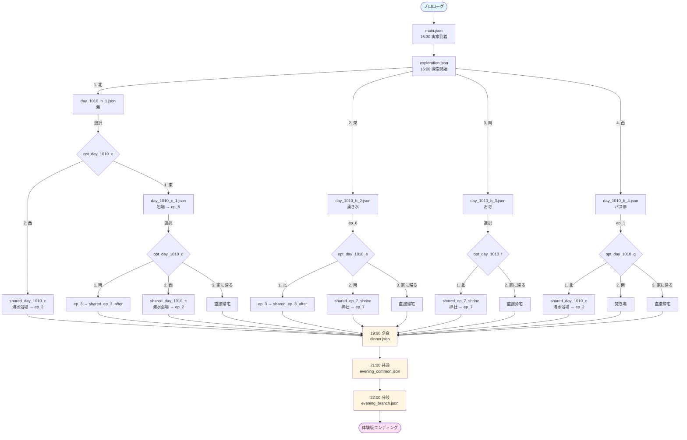
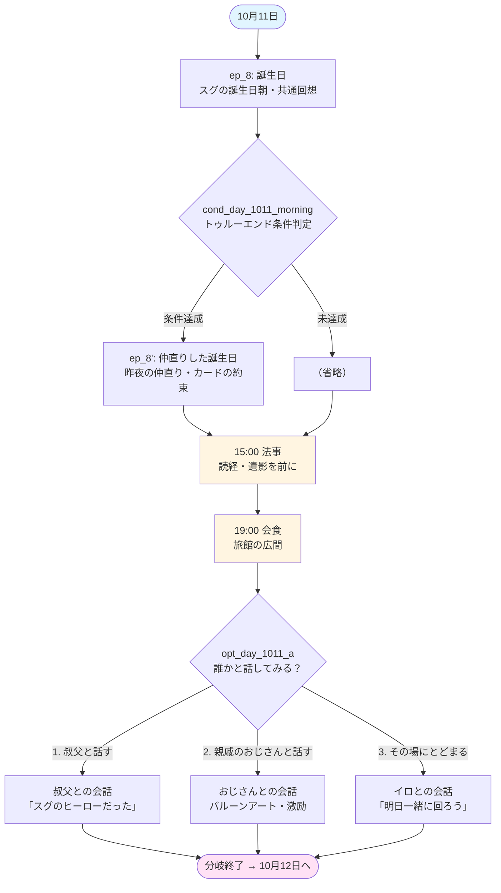

# キミノコエ - 開発概要書

失った記憶を、声で辿るアドベンチャー＆ノベルゲーム

------

## 1. ゲーム概要

### コンセプト

主人公が故郷「地蔵焚（じぞうだき）」に戻り、弟スグの命日を訪れる中で、混濁した記憶を辿っていくノベルゲーム。「声」をテーマとした多層のミスリードと、最後のカタルシスを目指す。

### コアミスリード（開発者のみ知るべき情報）

**ミスリード①: 主人公の声**

- 主人公はスグの事故のショックで声を失っている
- プレイヤーには最後まで気づかせない
- 家族・親戚は手話を覚えている
- 地の文で「伝えた」「応えた」と書くことでミスリード
- お寺さんは手話を知らないため、頷くだけの対応

**ミスリード②: キミノコエの意味**

- プレイヤーは「スグの声」だと思う
- 実は「自分の声（失った声）」でもある
- エンディングで「声に出して」と明かされる

**ミスリード③: 白い服の少年（2人存在）**

- 実在する少年: イロが知り合いの子供に頼んでスグのふりをさせた（エンディング後のお節介編で明かされる）
- 霊体の少年: スグの霊体。エピソード後に姿が見える（一部のエピソードのみ）
- プレイヤーには同一人物に見せかける

**ミスリード④: 記憶の混濁**

- ep_0は歪んだ記憶（喧嘩したまま事故へ）
- ep_0_βが真実（仲直りしていた、誕生日を楽しみにしていた）
- 罪悪感が記憶を歪めた
- 全プレイ後にep_0がep_0_βに切り替わる

------

## 2. キャラクター

### 時系列の整理

- **スグの事故**: 12年前の10月10日（13回忌のため）
- **主人公**: 事故当時9歳（1月生まれ） → 現在21歳（大学3年生、1浪）
- **スグ**: 享年8歳（10月生まれ、8歳の誕生日直後に事故）、主人公の1歳下（学年は2学年差）
- **イロ**: 事故当時は胎児（母のお腹の中） → 現在12歳（中学1年生）
- **母**: 事故当時妊娠中 → イロ出産後、精神を病み他界

### キャラクター一覧

| キャラクター   | 関係 | 年齢    | 特徴                                                         |
| -------------- | ---- | ------- | ------------------------------------------------------------ |
| 主人公         | 兄   | 21歳    | 大学3年生（1浪）。1月生まれ。声を失っている。記憶が混濁している |
| スグ           | 弟   | 享年8歳 | 12年前の10月10日に事故死。10月生まれ。野球好き。主人公の1歳下（学年は2学年差） |
| イロ           | 妹   | 12歳    | 中学1年生。天真爛漫。手話を知っている。事故当時は母のお腹の中にいた |
| 祖母           | 祖母 | -       | 鳥取弁を使う。手話を知っている                               |
| 父             | 父   | -       | あまり登場しない。手話を知っている                           |
| 母             | 母   | 故人    | スグの事故後、イロを出産。その後精神を病み、イロが幼い頃に他界 |
| 叔父           | 叔父 | -       | スグを自分の子のように思っていた。手話を知っている           |
| 親戚のおじさん | 親戚 | -       | テンションが高い。バルーンアート。手話を知っている           |
| お寺さん       | 住職 | -       | よそ者だが村を愛している。研究熱心。手話を知らない           |

### 主人公の浪人について

- 声を失ったこと自体は大学受験の障害にはならない（合理的配慮により、筆談受験や手話通訳者の同席が可能）
- しかし、スグを失った精神的ショック、罪悪感、記憶の混濁により、高校卒業時は受験に集中できなかった
- 1年の浪人期間を経て、心を整理し、19歳で大学に入学
- 現在21歳（大学3年生）だが、心の傷は完全には癒えていない
- これから就職活動を控えている時期

------

## 3. シナリオ構成

### エピソード一覧

エピソードの詳細（説明文・取得条件）は [trophy_system.md](trophy_system.md) を参照。

| エピソード | タイトル          | 霊体 | 状態 |
| ---------- | ----------------- | ---- | ---- |
| ep_0       | 命日（喧嘩ver）   | -    | 完成 |
| ep_0_β     | 命日（仲良しver） | -    | 完成 |
| ep_1       | カード            | ✓    | 完成 |
| ep_2       | 海                | ✓    | 完成 |
| ep_3       | バス停            | ✓    | 完成 |
| ep_4       | キャッチボール    | ×    | 完成（10月12日・トゥルー条件） |
| ep_5       | 捨て猫            | ×    | 完成 |
| ep_6       | 沢蟹              | ×    | 完成 |
| ep_7       | 神社              | ×    | 完成 |
| ep_8       | 誕生日            | ×    | 完成（10月11日冒頭） |
| ep_8'      | 仲直りした誕生日  | ×    | 完成（ep_8内・トゥルー条件時のみ） |
| ep_9       | 怪魚              | ×   | 完成（製品版・10月12日） |
| ep_10      | クワガタ          | ×   | 完成（製品版・10月12日） |
| ep_11      | 飲み比べ          | ×   | 完成（製品版・10月12日） |

### 霊体の描写パターン（エピソード後）

霊体が見えるエピソード（ep_1, ep_2, ep_3）のみに配置。

描写のポイント：

- 半透明、ぼんやり、輪郭が曖昧
- 場所の特徴に合わせた比喩（波の泡、夕暮れの光など）
- 目をこすると/瞬きをすると消える
- その後「スグだったのだろうか」という不確かな反応

霊体が見えないエピソード（ep_4, ep_5, ep_6, ep_7）は、温かい思い出として自然に終わる。

### 記憶の混濁の表現

シナリオ各所に「思い出せない」「霞んでいる」「違和感がある」を散らばせている。

- 梨のシーン: 「スグはこの梨が好きだっただろうか？――思い出せない」
- 地下道: 「白い服の少年――どこかで見たような気がする。でも、思い出せなかった」
- 叔父との会話: 「正直あまり記憶になかった」
- エピソード後: 「でも――なんだろう……。その違和感がぬぐい切れなかった」

### 童歌「ふたこじぞう」

```
じぞうさま　じぞうさま
どちらの子が　ピーヒョロロ
ひび割れた　ひび割れた
あたまおなか　手とあし
ぱちぱち燃えたら
川へゆく　川へゆく
```

- 「ピーヒョロロ」= 鳶の鳴き声（プロローグと呼応）
- 意味の解説はプレイヤーに考察させる
- 東（湧き水）のルートで、おばあさんが口ずさんでいて発見される

### シナリオフロー図（10月10日）



**フロー図の説明**:
- プロローグから実家到着（15:30）を経て、16:00に探索開始
- 4方向（北・東・南・西）から選択可能
- 各ルートでさらに分岐があり、エピソードを取得
- すべてのルートが19:00の夕食シーンに合流
- 夕食後、21:00共通シーン、22:00分岐シーンを経て体験版エンディングへ

**詳細なテストケースは `test_cases.md` を参照**

### シナリオフロー図（10月11日）



**フロー図の説明**:
- 冒頭で ep_8「誕生日」が呼び出される（スグの誕生日朝・現在時点の回想）
- ep_8 内部で前日のトゥルーエンド条件を判定し、達成していれば ep_8'「仲直りした誕生日」を続けて表示
- 15:00 法事 → 19:00 会食（旅館）と進み、会食で選択肢が1回だけある
- 選択肢の結果に関わらず 10月12日へ続く

------

## 4. トロフィー/称号システム

> 詳細仕様は [trophy_system.md](trophy_system.md) 参照。

## 5. 地蔵焚の設定

### 村の構成

- 北に海、南に山
- 実家が村の真ん中
- 東西南北に道が伸びる

### 重要な場所

- **兄の水**: 東側の清流（軟水）
- **弟の水**: 西側の清流（硬水）
- 二筋の川は古い『しきたり』で地蔵を流す場所だった
- **お寺の裏の大きな木**: 秘密基地。物語の重要な場所として温存
- **高台の空き地**: かつての商店の跡地（深い意味はない）
- **焚き場の跡**: 別途登場予定

### しきたり（裏設定）

- 兄弟それぞれが小さな地蔵を持つ
- 兄弟が同時に病むと、どちらかの地蔵を囲炉裏で焚べる
- 罅の入った部分が「引き受けた病の場所」
- 燃やした地蔵は川に流す
- やがて「大きな災いを無数の小さな痛みに分ける」ことに気づき、毎晩誰かが地蔵を焚べるようになった
- 今では忘れ去られている

### ふたこじぞう（地蔵の配置）

- 村の各所に2体並びの地蔵が配置されている
- 北ルート: 階段の中腹
- 東ルート: 兄の水の脇
- 南ルート: 裏山への道
- 西ルート: 墓地の近く（1体だけ）← マルチシナリオへの伏線

------

## 6. 技術仕様

### プロジェクト構成

```
kiminokoe/
├── assets/                    # リソースファイル
│   ├── backgrounds/          # 背景画像
│   ├── bgm/                  # BGM（旧 music/ は廃止）
│   ├── fonts/                # フォント
│   ├── shaders/              # シェーダー
│   └── sounds/               # 効果音
├── scenarios/                # シナリオファイル（JSON）
│   ├── main.json
│   ├── days/
│   ├── branches/
│   ├── shared/              # 共用シナリオ
│   └── episodes/
├── scenes/                   # シーンファイル
├── scripts/                  # GDScriptスクリプト
├── shaders/                  # シェーダー
└── themes/                   # テーマ
```

### シナリオJSON記法のコマンド対応

| コマンド        | 機能                             |
| --------------- | -------------------------------- |
| dialogue        | テキスト表示                     |
| background      | 背景変更                         |
| bgm             | BGM再生（エイリアス名で指定）    |
| sfx             | 効果音再生（ワンショット）       |
| sfx_loop        | 環境音ループ再生開始             |
| sfx_loop_stop   | 環境音ループ停止                 |
| subtitle        | サブタイトル表示                 |
| poem            | 詩・童歌フルスクリーン表示（1行ずつ） |
| choice          | 選択肢表示                       |
| load_scenario   | 別シナリオ読み込み               |
| jump            | インデックスジャンプ             |
| flashback_start | 回想モード開始（グレースケール） |
| flashback_end   | 回想モード終了                   |
| episode_clear   | エピソードクリア記録             |
| visit_location  | 場所訪問記録（シークレットトロフィー用） |
| index           | インデックスマーカー             |

### BGMエイリアス・SE配置一覧

> 詳細は [audio_design.md](audio_design.md) 参照。

### 実装済み機能

1. テキスト表示（タイプライター効果、ページバッファ、BBCodeインジケータ）
2. 背景システム（フェード、回想モード）
3. 音声システム（BGM/SFX、AudioManagerオートロード — シーンをまたいでBGM継続再生）
4. 選択肢システム（マウス/キーボード対応）
5. サブタイトルシステム（2行形式、`next_background` パラメータ）
6. 詩・童歌フルスクリーン表示（PoemDisplay — `scripts/ui/poem_display.gd`、layer=55）
7. シナリオシステム（JSON読み込み、スタック、キャッシュ）
8. スキップ機能（早歩き）
9. トロフィーシステム（軌跡画面、トースト通知、リセット機能）
10. シーン管理（タイトル/セーブ情報/設定/軌跡/名前入力/ゲーム画面）
11. 設定システム（テキスト速度、音量、ウィンドウモード、起動時自動適用）
12. ポーズメニュー（一息）
13. 足跡（テキストログ/バックログ）
14. プレイ時間計測（ゲーム中に計測、オートセーブに含む）
15. セーブ情報画面（つづきからはじめる/はじめからはじめる/データリセット）
16. セーブシステム（ワンセーブデータ方式、オートセーブ、つづきから/はじめから/データリセット）
17. タイトル演出（波紋シェーダー `water_wave.gdshader`、BGMフェードインと同期したフェードイン）
18. 起動設定（ブートスプラッシュ削除、ウィンドウタイトル「キミノコエ」、カスタムアイコン）

### UI/UXデザイン

> 詳細は [ui_design.md](ui_design.md) 参照。

### シナリオJSON記法・ファイル命名規則

> 詳細は [scenario_rules.md](scenario_rules.md) の「JSONコマンドリファレンス」セクション参照。

------

## 7. 開発のルール

### シナリオの書き方（重要）

- 主人公は声を出してはいけない（現在時点のシーン）
- 過去のエピソード内では声を出してOK
- 手話を知っている人との会話では「伝えた」「応えた」と書く（ミスリード）
- お寺さんとの会話では頷くだけ
- 霊体を出すかどうかは意図的に使い分ける

### エピソード後の描写の規則

- エピソード後は必ず「……。…………。………………。」で始まる（放心状態）
- 霊体を出すエピソードは、その後に霊体の描写を入れる
- 霊体を出さないエピソードは、温かい余韻で終わる

### current_index のインクリメント規則

`scenario_engine.gd` のメインループにおける `current_index` の進行責務は以下の通り：

| コマンド種別 | インクリメント担当 | 理由 |
|---|---|---|
| `load_scenario` | メインループ | `call_subscenario` は状態復帰のみ |
| `episode_clear`, `visit_location` | メインループ | 単純な処理後に次へ進む |
| `jump`, `choice`, `branch` | 各ハンドラ | フロー制御コマンドのため自分で行き先を設定 |
| 通常コマンド（dialogue等） | メインループ | CommandExecutor 実行後に次へ進む |

**重要な原則:**
- `call_subscenario()` は元の index に復帰するだけで、進行しない
- 進行の責任は常に呼び出し元（メインループまたはハンドラ）にある

### choice コマンドのパターンと注意点

choice で `scenario` パラメータを使うと、サブシナリオから戻った後に **choice の次のコマンド** が実行される。これは `handle_choice()` 内で `current_index += 1` されるため。

**問題となるパターン（scenario と next_index の混在）:**
```json
{
    "type": "choice",
    "choices": [
        { "text": "選択肢A", "scenario": "shared/some_scenario" },
        { "text": "選択肢B", "next_index": 26 }
    ]
},
{ "type": "dialogue", "text": "選択肢Bでのみ表示したいテキスト" }
```
→ 選択肢Aから戻った後も「選択肢Bでのみ表示したいテキスト」が実行されてしまう。

**正しいパターン①: index マーカーで分岐を分離**

全選択肢で `next_index` を使い、各分岐を明確に分離する：
```json
{
    "type": "choice",
    "choices": [
        { "text": "選択肢A", "next_index": 100 },
        { "text": "選択肢B", "next_index": 26 }
    ]
},
{ "type": "index", "index": 26 },
{ "type": "dialogue", "text": "選択肢Bの内容" },
{ "type": "jump", "index": 999 },
{ "type": "index", "index": 100 },
{ "type": "load_scenario", "path": "shared/some_scenario", "new_page_after_return": true },
{ "type": "index", "index": 999 }
```

**正しいパターン②: 全選択肢で scenario を使う**

choice の後にコマンドを一切置かない：
```json
{
    "type": "choice",
    "choices": [
        { "text": "選択肢A", "scenario": "branches/path_a" },
        { "text": "選択肢B", "scenario": "branches/path_b" }
    ]
}
```
→ choice が最後のコマンドなので、どの選択肢から戻っても安全にシナリオが終了する。

------

## 8. マルチシナリオ（将来予定）

### シリーズ構成

| 編名 | 主人公 | 時期 | 概要 | 状態 |
|---|---|---|---|---|
| キミノコエ編 | 主人公（兄） | 13回忌（現在） | 本編。記憶を辿る旅 | 実装完了（素材面の残課題あり） |
| お節介編 | イロ | エンディング後 | 本編の計画の全貌が明かされる | **シナリオ執筆開始フェーズ** |
| JMR編 | お寺さん | 1年後 | しきたりと地蔵の謎に迫る | 骨子のみ（お節介編完了後に着手） |

シナリオ原稿は `documents/dev/scenarios/` 以下に各編1ファイルで管理する。

### キミノコエ編との伏線関係

以下の要素は、現時点では「なんとなく不安」「関係があるかも」という雰囲気の装飾として機能している。プレイヤーに「気になるが、今は答えがない」と感じさせる。

- 童歌「ふたこじぞう」の意味
- 「兄の水」「弟の水」と焚き場の跡
- しきたりの詳細
- 1体だけの地蔵（西ルート）

これらは将来のマルチシナリオで本格的に回収される。そのため、現時点のシナリオでこれらを「説明しすぎる」感じで描写してしまうと、将来のシナリオで「あ、もう明かされてた」になりうるため注意が必要。

------

## 9. お節介編（エンディング後・イロが主人公）

### 概要

エンディング後に解放される追加ストーリー。イロを主人公とし、本編で「なぜ」が明かされる。
シナリオ原稿: `documents/dev/scenarios/osekkai.md`

### イロの動機

- 本編では語られないが、スグが亡くなった後に母親は気が狂ってしまい他界している
- イロは事故当時は母のお腹の中にいた（胎児）ため、事故の記憶が一切ない
- スグの事故後に生まれ、母はイロを出産した後、スグを失った悲しみで精神を病み、イロが幼い頃に他界した
- イロが知っていたのは以下の事実：
  - 兄が言葉を失っていること
  - スグが事故で亡くなったこと
  - ふたりは喧嘩をしていたので仲が悪かった（と解釈していた）
  - そのため兄が後悔していること
- ある時に母の日記を見つけた。その日記には、実際には2人の兄が仲が良かった事実が書かれていた

### イロの計画

- 兄を苦しみから解放してあげたいと、友人とその親戚に協力を頼んだ
- その友人の子供が「実在する少年」に当たる（その少年の兄が実在する子供の兄）
- 少年にダキに存在しないスグの姿を見せることで、主人公にスグを連想させた
- 手紙による仲直りを体現させることで、少しでも気持ちを楽にさせてあげようとした
- イロは本編の全体を「計画」として行動していた（バス停での出迎えも含む）

### 本編との関係

- 本編では「天真爛漫な妹」に見えるイロの行動が、マル秘ストーリーで「計画」として見え直す
- 本編で「あんな子、ダキにいたか？」と自然に流していたイロの反応は、マル秘を読んだ後で「やっぱり知っていた」に見え直す
- 霊体の実のスグの登場により、イロの計画の予想を超えて、声を取り戻すところまで進む

