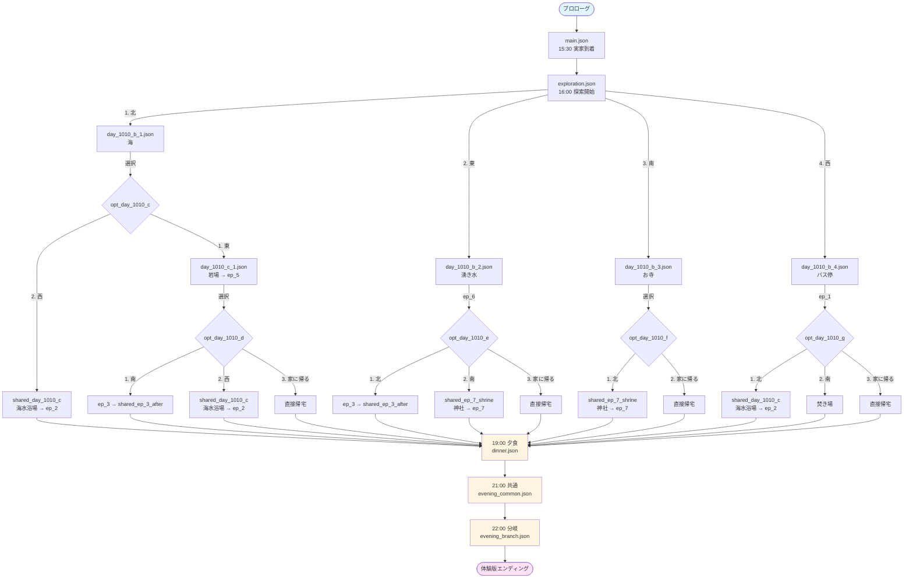

# キミノコエ - 開発概要書

失った記憶を、声で辿るアドベンチャー＆ノベルゲーム

------

## 1. ゲーム概要

### コンセプト

主人公が故郷「地蔵焚（じぞうだき）」に戻り、弟スグの命日を訪れる中で、混濁した記憶を辿っていくノベルゲーム。「声」をテーマとした多層のミスリードと、最後のカタルシスを目指す。

### コアミスリード（開発者のみ知るべき情報）

**ミスリード①: 主人公の声**

- 主人公はスグの事故のショックで声を失っている
- プレイヤーには最後まで気づかせない
- 家族・親戚は手話を覚えている
- 地の文で「伝えた」「応えた」と書くことでミスリード
- お寺さんは手話を知らないため、頷くだけの対応

**ミスリード②: キミノコエの意味**

- プレイヤーは「スグの声」だと思う
- 実は「自分の声（失った声）」でもある
- エンディングで「声に出して」と明かされる

**ミスリード③: 白い服の少年（2人存在）**

- 実在する少年: イロが知り合いの子供に頼んでスグのふりをさせた（エンディング後のマル秘ストーリーで明かされる）
- 霊体の少年: スグの霊体。エピソード後に姿が見える（一部のエピソードのみ）
- プレイヤーには同一人物に見せかける

**ミスリード④: 記憶の混濁**

- ep_0は歪んだ記憶（喧嘩したまま事故へ）
- ep_0_βが真実（仲直りしていた、誕生日を楽しみにしていた）
- 罪悪感が記憶を歪めた
- 全プレイ後にep_0がep_0_βに切り替わる

------

## 2. キャラクター

### 時系列の整理

- **スグの事故**: 12年前の10月10日（13回忌のため）
- **主人公**: 事故当時9歳（1月生まれ） → 現在21歳（大学3年生、1浪）
- **スグ**: 享年8歳（10月生まれ、8歳の誕生日直後に事故）、主人公の1歳下（学年は2学年差）
- **イロ**: 事故当時は胎児（母のお腹の中） → 現在12歳（中学1年生）
- **母**: 事故当時妊娠中 → イロ出産後、精神を病み他界

### キャラクター一覧

| キャラクター   | 関係 | 年齢    | 特徴                                                         |
| -------------- | ---- | ------- | ------------------------------------------------------------ |
| 主人公         | 兄   | 21歳    | 大学3年生（1浪）。1月生まれ。声を失っている。記憶が混濁している |
| スグ           | 弟   | 享年8歳 | 12年前の10月10日に事故死。10月生まれ。野球好き。主人公の1歳下（学年は2学年差） |
| イロ           | 妹   | 12歳    | 中学1年生。天真爛漫。手話を知っている。事故当時は母のお腹の中にいた |
| 祖母           | 祖母 | -       | 鳥取弁を使う。手話を知っている                               |
| 父             | 父   | -       | あまり登場しない。手話を知っている                           |
| 母             | 母   | 故人    | スグの事故後、イロを出産。その後精神を病み、イロが幼い頃に他界 |
| 叔父           | 叔父 | -       | スグを自分の子のように思っていた。手話を知っている           |
| 親戚のおじさん | 親戚 | -       | テンションが高い。バルーンアート。手話を知っている           |
| お寺さん       | 住職 | -       | よそ者だが村を愛している。研究熱心。手話を知らない           |

### 主人公の浪人について

- 声を失ったこと自体は大学受験の障害にはならない（合理的配慮により、筆談受験や手話通訳者の同席が可能）
- しかし、スグを失った精神的ショック、罪悪感、記憶の混濁により、高校卒業時は受験に集中できなかった
- 1年の浪人期間を経て、心を整理し、19歳で大学に入学
- 現在21歳（大学3年生）だが、心の傷は完全には癒えていない
- これから就職活動を控えている時期

------

## 3. シナリオ構成

### エピソード一覧

| エピソード | タイトル          | 内容                             | 霊体 | 状態                   |
| ---------- | ----------------- | -------------------------------- | ---- | ---------------------- |
| ep_0       | 命日（喧嘩ver）   | 喧嘩したまま事故へ（歪んだ記憶） | -    | 完成                   |
| ep_0_β     | 命日（仲良しver） | 仲直りしていた（真実）           | -    | 完成                   |
| ep_1       | カード            | キラカードを弟に渡す             | ✓    | 完成                   |
| ep_2       | 海                | 波に揉まれ弟に助けられる         | ✓    | 完成                   |
| ep_3       | バス停            | 冬の待ちぼうけ、コートを貸す     | ✓    | 完成                   |
| ep_4       | キャッチボール    | 弟の悩みを解決する               | ×    | 完成（10月12日で使用） |
| ep_5       | 捨て猫            | 4人で捨て猫を救う                | ×    | 完成                   |
| ep_6       | 沢蟹              | 兄の水で石を持ち上げて沢蟹探し   | ×    | 完成                   |
| ep_7       | 神社              | 擁壁工を登って降りられなくなる   | ×    | 完成                   |

### 霊体の描写パターン（エピソード後）

霊体が見えるエピソード（ep_1, ep_2, ep_3）のみに配置。

描写のポイント：

- 半透明、ぼんやり、輪郭が曖昧
- 場所の特徴に合わせた比喩（波の泡、夕暮れの光など）
- 目をこすると/瞬きをすると消える
- その後「スグだったのだろうか」という不確かな反応

霊体が見えないエピソード（ep_4, ep_5, ep_6, ep_7）は、温かい思い出として自然に終わる。

### 記憶の混濁の表現

シナリオ各所に「思い出せない」「霞んでいる」「違和感がある」を散らばせている。

- 梨のシーン: 「スグはこの梨が好きだっただろうか？――思い出せない」
- 地下道: 「白い服の少年――どこかで見たような気がする。でも、思い出せなかった」
- 叔父との会話: 「正直あまり記憶になかった」
- エピソード後: 「でも――なんだろう……。その違和感がぬぐい切れなかった」

### 童歌「ふたこじぞう」

```
じぞうさま　じぞうさま
どちらの子が　ピーヒョロロ
ひび割れた　ひび割れた
あたまおなか　手とあし
ぱちぱち燃えたら
川へゆく　川へゆく
```

- 「ピーヒョロロ」= 鳶の鳴き声（プロローグと呼応）
- 意味の解説はプレイヤーに考察させる
- 東（湧き水）のルートで、おばあさんが口ずさんでいて発見される

### シナリオフロー図（10月10日）



**フロー図の説明**:
- プロローグから実家到着（15:30）を経て、16:00に探索開始
- 4方向（北・東・南・西）から選択可能
- 各ルートでさらに分岐があり、エピソードを取得
- すべてのルートが19:00の夕食シーンに合流
- 夕食後、21:00共通シーン、22:00分岐シーンを経て体験版エンディングへ

**詳細なテストケースは `test_cases.md` を参照**

------

## 4. トロフィー/称号システム 仕様書

------

### トロフィー一覧

#### 通常トロフィー（エピソード系）

| トロフィー名   | 取得条件  | 説明文                     |
| -------------- | --------- | -------------------------- |
| カード         | ep_1 回収 | 「キミと喧嘩をした日」     |
| 海             | ep_2 回収 | 「波との戦い」             |
| バス停         | ep_3 回収 | 「吹雪と兄弟」             |
| キャッチボール | ep_4 回収 | 「下手だけど好きだから」   |
| 捨て猫         | ep_5 回収 | 「シロとの出会い」         |
| 沢蟹           | ep_6 回収 | 「このカニ食べれるの？」   |
| 神社           | ep_7 回収 | 「実は高所恐怖症の兄」     |

**計: 7個**

**注意**: ep_0「命日」はプロローグで必ず見るため、トロフィー対象外

------

#### シークレットトロフィー（隠し）

| トロフィー名   | 取得条件                            | 説明文                             | ヒント                     | 備考                   |
| -------------- | ----------------------------------- | ---------------------------------- | -------------------------- | ---------------------- |
| 秘密基地       | 南ルート訪問                        | 「僕たちだけの場所」               | 「お寺の裏山に...」        | トゥルー条件の1つ      |
| ふたこじぞう   | 全地蔵発見（北・東・南・西の4箇所） | 「古くから村を守ってきた存在」     | 「村の至る所に...」        | コレクション要素       |
| 焚き場         | 西→南訪問                           | 「忘れ去られたしきたり」           | 「禁じられた道の先に...」  | マルチシナリオへの伏線 |
| 童歌           | 童歌をスキップせずに最後まで聴く    | 「祈りは忘れられ、調べだけが継ぐ」 | 「立ち止まって耳を傾けて」 | 早歩き中は取得不可     |
| 地蔵焚の旅人   | 下記条件をすべて満たした状態で童歌を聴く | 「体験版でそこまでする？」    | 「すべてを巡り、耳を澄ませたとき」 | 体験版限定・やり込み |
| キミノコエ     | トゥルーエンド到達                  | 「喉が……のど飴を常備しないと」     | 「すべてを思い出したとき」 | 最終トロフィー         |
| イロの想い     | マル秘ストーリー閲覧                | 「実は計画的な妹」                 | 「真実を知ったとき」       | エンディング後解放     |

**計: 7個**

**全トロフィー: 14個**

#### 「地蔵焚の旅人」取得条件（体験版限定）

以下をすべて満たした状態で、童歌をスキップせずに最後まで聴く：

1. **プレイ時間3時間以上**
2. **通常トロフィー6個全取得**: カード、海、バス停、捨て猫、沢蟹、神社（キャッチボールは製品版）
3. **シークレットトロフィー4個全取得**: 秘密基地、ふたこじぞう、焚き場、童歌

**判定タイミング**: 童歌を聴いた瞬間のみ（ED到達時には判定しない）

------

### トゥルーエンド到達条件

#### 必須条件

```
秘密基地（シークレットトロフィー）
AND
霊体付きエピソード3つすべて
  - カード（ep_1）
  - 海（ep_2）
  - バス停（ep_3）
```

#### 補足

- 最低でも**4箇所**訪問が必要（秘密基地 + 霊体エピソード3つ）
- 10月10日の自由時間は**2枠**なので、1周では到達不可能
- **複数周プレイ前提**の設計

------

### 10月10日エンド分岐条件

| 分岐名                       | 条件                                  | 10日エンドの内容                                           | トーン         |
| ---------------------------- | ------------------------------------- | ---------------------------------------------------------- | -------------- |
| **トゥルー条件達成**         | 秘密基地 AND (ep_1 AND ep_2 AND ep_3) | すべての記憶が繋がる感覚<br>「明日、何かが変わる気がする」 | 期待感、予感   |
| **高回収（トゥルー未達成）** | エピソード5-6個 AND NOT トゥルー条件  | 多くを思い出した<br>「もっと思い出せるかもしれない」       | 充実感、希望   |
| **中回収**                   | エピソード3-4個 AND NOT トゥルー条件  | いくつか思い出した<br>「まだ足りない...」                  | 懐かしさと焦燥 |
| **低回収**                   | エピソード1-2個                       | わずかな記憶の断片<br>「スグのこと、もっと知りたい」       | もどかしさ     |
| **最低**                     | エピソード0個                         | ほとんど思い出せない<br>「明日の法事で、何か...」          | 空虚感、祈り   |

------

### エンディング分岐

| ルート             | 条件               | 12日の展開                                         | エンディング                         |
| ------------------ | ------------------ | -------------------------------------------------- | ------------------------------------ |
| **トゥルーエンド** | 秘密基地 + 霊体3つ | 手紙イベント発生 → 秘密基地  → 声の回復 → 霊体スグ | 「声に出して、そう応えた」           |
| **ノーマルエンド** | 上記以外           | 手紙イベント不発 →10日と同様の探索 →帰宅           | （考え中だが引っ掛かりが残る感じに） |

### 軌跡画面UI案

#### 取得前の表示

```
【通常トロフィー】
□ カード           （未取得はグレーアウト）
□ 海
□ バス停
□ キャッチボール
□ 捨て猫
□ 沢蟹
□ 神社

【シークレットトロフィー】
？？？              （取得前は？表示）
？？？
？？？
？？？
？？？

進行度: 0/12 (0%)
```

#### 一部取得後の表示

```
【通常トロフィー】
■ カード           「キラカードをあげた日」
□ 海
■ バス停           「雪の日の待ちぼうけ」
□ キャッチボール
■ 捨て猫           「みんなで子猫を救った日」
□ 沢蟹
□ 神社

【シークレットトロフィー】
■ 秘密基地         「僕たちだけの場所」
？？？
？？？
？？？
？？？

進行度: 4/12 (33%)
```

------

### 軌跡ヒント集（ゲーム内表示用）

プレイヤーがトロフィー画面でヒントを見られるようにする。

※ここは使わないかも

| トロフィー     | ヒント                     |
| -------------- | -------------------------- |
| カード         | 「高台の空き地で...」      |
| 海             | 「海水浴場で...」          |
| バス停         | 「雨宿りをした場所で...」  |
| キャッチボール | 「12日の朝に...」          |
| 捨て猫         | 「用水路で...」            |
| 沢蟹           | 「兄の水で...」            |
| 神社           | 「鳥居の先で...」          |
| 秘密基地       | 「お寺の裏山に...」        |
| ふたこじぞう   | 「村の至る所に...」        |
| 焚き場         | 「禁じられた道の先に...」  |
| キミノコエ     | 「すべてを思い出したとき」 |
| イロの想い     | 「真実を知ったとき」       |

## 5. 地蔵焚の設定

### 村の構成

- 北に海、南に山
- 実家が村の真ん中
- 東西南北に道が伸びる

### 重要な場所

- **兄の水**: 東側の清流（軟水）
- **弟の水**: 西側の清流（硬水）
- 二筋の川は古い『しきたり』で地蔵を流す場所だった
- **お寺の裏の大きな木**: 秘密基地。物語の重要な場所として温存
- **高台の空き地**: かつての商店の跡地（深い意味はない）
- **焚き場の跡**: 別途登場予定

### しきたり（裏設定）

- 兄弟それぞれが小さな地蔵を持つ
- 兄弟が同時に病むと、どちらかの地蔵を囲炉裏で焚べる
- 罅の入った部分が「引き受けた病の場所」
- 燃やした地蔵は川に流す
- やがて「大きな災いを無数の小さな痛みに分ける」ことに気づき、毎晩誰かが地蔵を焚べるようになった
- 今では忘れ去られている

### ふたこじぞう（地蔵の配置）

- 村の各所に2体並びの地蔵が配置されている
- 北ルート: 階段の中腹
- 東ルート: 兄の水の脇
- 南ルート: 裏山への道
- 西ルート: 墓地の近く（1体だけ）← マルチシナリオへの伏線

------

## 6. 技術仕様

### プロジェクト構成

```
kiminokoe/
├── assets/                    # リソースファイル
│   ├── backgrounds/          # 背景画像
│   ├── bgm/                  # BGM（旧 music/ は廃止）
│   ├── fonts/                # フォント
│   ├── shaders/              # シェーダー
│   └── sounds/               # 効果音
├── scenarios/                # シナリオファイル（JSON）
│   ├── main.json
│   ├── days/
│   ├── branches/
│   ├── shared/              # 共用シナリオ
│   └── episodes/
├── scenes/                   # シーンファイル
├── scripts/                  # GDScriptスクリプト
├── shaders/                  # シェーダー
└── themes/                   # テーマ
```

### シナリオJSON記法のコマンド対応

| コマンド        | 機能                             |
| --------------- | -------------------------------- |
| dialogue        | テキスト表示                     |
| background      | 背景変更                         |
| bgm             | BGM再生                          |
| sfx             | 効果音再生                       |
| subtitle        | サブタイトル表示                 |
| poem            | 詩・童歌フルスクリーン表示（1行ずつ） |
| choice          | 選択肢表示                       |
| load_scenario   | 別シナリオ読み込み               |
| jump            | インデックスジャンプ             |
| flashback_start | 回想モード開始（グレースケール） |
| flashback_end   | 回想モード終了                   |
| episode_clear   | エピソードクリア記録             |
| visit_location  | 場所訪問記録（シークレットトロフィー用） |
| index           | インデックスマーカー             |

### 実装済み機能

1. テキスト表示（タイプライター効果、ページバッファ、BBCodeインジケータ）
2. 背景システム（フェード、回想モード）
3. 音声システム（BGM/SFX、AudioManagerオートロード — シーンをまたいでBGM継続再生）
4. 選択肢システム（マウス/キーボード対応）
5. サブタイトルシステム（2行形式、`next_background` パラメータ）
6. 詩・童歌フルスクリーン表示（PoemDisplay — `scripts/ui/poem_display.gd`、layer=55）
7. シナリオシステム（JSON読み込み、スタック、キャッシュ）
8. スキップ機能（早歩き）
9. トロフィーシステム（軌跡画面、トースト通知、リセット機能）
10. シーン管理（タイトル/セーブ情報/設定/軌跡/名前入力/ゲーム画面）
11. 設定システム（テキスト速度、音量、ウィンドウモード、起動時自動適用）
12. ポーズメニュー（一息）
13. 足跡（テキストログ/バックログ）
14. プレイ時間計測（ゲーム中に計測、オートセーブに含む）
15. セーブ情報画面（つづきからはじめる/はじめからはじめる/データリセット）
16. セーブシステム（ワンセーブデータ方式、オートセーブ、つづきから/はじめから/データリセット）
17. タイトル演出（波ゆらぎシェーダー、波紋オーバーレイ、BGMフェードインと同期したフェードイン）
18. 起動設定（ブートスプラッシュ削除、ウィンドウタイトル「キミノコエ」、カスタムアイコン）

### UI/UXデザイン決定事項

#### フォント

- **使用フォント**: しっぽり明朝（Shippori Mincho）SemiBold
- **選定理由**: ホラー・ノベルゲームの雰囲気に合う明朝体。SemiBold で視認性を確保しつつ、明朝体の繊細さを保持
- **適用範囲**: 全画面共通（タイトル、ゲーム本文、設定画面、ポーズメニュー等）
- **設定方法**: `project.godot` の `gui/theme/custom_font` でプロジェクト全体に適用。ゲーム本文は `novel_theme.tres` でも指定
- **フォントファイル**: `assets/fonts/ShipporiMincho-SemiBold.ttf`

#### テキスト縁取り（アウトライン）

- **サイズ**: 2px
- **色**: 黒（不透明度90%）
- **適用対象**: ゲーム画面の本文テキスト（RichTextLabel）、選択肢プロンプト・選択肢ラベル（Label）
- **目的**: 背景画像の上でもテキストの可読性を確保

#### デザイントークン管理

- `scripts/ui/ui_constants.gd` — 色、フォントサイズ、レイアウト定数を一元管理
- `scripts/ui/ui_style_helper.gd` — 再利用可能なスタイリングユーティリティ

#### カラーパレット

##### 設計方針

和風・古き良き日本をコンセプトに、暖色系で統一したカラーパレット。
墨色をベースに、生成りのテキストで和紙のような温かみを、赤銅のアクセントで血と錆の質感を表現する。
サブカラーも丁子茶・灰白の暖色系で揃え、寒色を排除して統一感を持たせている。

##### テーマカラー（5色）

| 役割            | 色名   | HEX     | Godot Color                    | イメージ             |
| --------------- | ------ | ------- | ------------------------------ | -------------------- |
| メイン          | 生成り | #f5f5dc | `Color(0.961, 0.961, 0.863)`   | 和紙、温かみ         |
| アクセント      | 赤銅   | #a04030 | `Color(0.627, 0.251, 0.188)`   | 血、錆、和の情熱     |
| ベース（暗）    | 墨色   | #1c1c1c | `Color(0.11, 0.11, 0.11)`      | 墨、古い村           |
| サブアクセント  | 丁子茶 | #8c7a6b | `Color(0.549, 0.478, 0.420)`   | 暖かみのある灰茶     |
| 霊体/ミステリー | 灰白   | #c8c2b6 | `Color(0.784, 0.761, 0.714)`   | 暖色寄りオフホワイト |

**配色の意図**:

- 赤銅 × 墨色: 錆びた金属と墨の質感。血っぽさと和のテーストの両立
- 生成り: 和紙の温かみ、古い手紙
- 丁子茶: 茶道の侘び寂びを想起させる暖色グレー（セカンダリテキスト、ボーダー）
- 灰白: 暖色系のオフホワイト。霊体やミステリアスな要素に寒色を使わず統一

##### 派生色（テーマカラーから自動生成）

`ui_constants.gd` では5つの `const` テーマカラーから `static var` で派生色を自動生成する設計。
テーマカラーを変更すれば、全UIが自動で追従する。

| 用途                 | 派生元                         | 値                                    |
| -------------------- | ------------------------------ | ------------------------------------- |
| テキスト（主）       | 生成り                         | `Color(COLOR_BASE_LIGHT, 1.0)`        |
| テキスト（副）       | 丁子茶                         | `Color(COLOR_SUB_ACCENT, 1.0)`        |
| テキスト（アクセント）| 赤銅                          | `Color(COLOR_ACCENT, 1.0)`            |
| テキスト（無効）     | 墨色 +33%明               | `Color(COLOR_BASE_DARK.lightened(0.33), 1.0)` |
| 背景（オーバーレイ） | 墨色 50%                       | `Color(COLOR_BASE_DARK, 0.5)`         |
| パネル背景           | 墨色 85%                       | `Color(COLOR_BASE_DARK, 0.85)`        |
| メニュー背景         | 墨色 90%                       | `Color(COLOR_BASE_DARK, 0.9)`         |
| ボタン背景           | 墨色 +8%明 80%             | `Color(COLOR_BASE_DARK.lightened(0.08), 0.8)` |
| ボーダー             | 丁子茶                         | `Color(COLOR_SUB_ACCENT, 1.0)`        |
| ボーダー（ホバー）   | 赤銅                           | `Color(COLOR_ACCENT, 1.0)`            |
| スキップ中           | 赤銅                           | `Color(COLOR_ACCENT, 1.0)`            |
| 装飾線               | 赤銅 50%                       | `Color(COLOR_ACCENT, 0.5)`            |
| エントリボーダー     | 赤銅 40%                       | `Color(COLOR_ACCENT, 0.4)`            |
| セパレーター         | 赤銅 15%                       | `Color(COLOR_ACCENT, 0.15)`           |
| アウトライン         | 墨色（最暗）90%            | `Color(COLOR_BASE_DARK.darkened(1.0), 0.9)` |

#### フォントサイズ

| 用途 | サイズ |
|---|---|
| タイトル | 36px |
| 見出し | 28px |
| 本文 | 24px |
| ボタン（大） | 32px |
| ボタン（通常） | 20px |
| キャプション | 16px |

#### ゲーム画面下部メニュー

- **ボタン**: 足跡 / 早歩き / 一息
- **デザイン**: 背景・ボーダーなし、テキストのみ（シームレス）
- **通常時**: 丁子茶文字（キャプションサイズ）、ホバーで赤銅に変化
- **早歩き中**: 「早歩き」ボタンの文字色が赤銅に変化
- **実装**: `scripts/ui/bottom_menu.gd`

#### ポーズメニュー

- **開閉**: Escapeキー（下部メニューの「一息」ボタンでも開く）
- **実装**: `scripts/ui/pause_menu.gd`（CanvasLayer layer=40 上に配置）
- **デザイン**: 足跡と統一した和風デザイン（装飾線タイトル ── 一息 ──、赤銅アクセント、フラットボタン+左ボーダーホバー）
- **背景**: 墨色 95%不透明 `Color(COLOR_BASE_DARK, 0.95)`
- **ボタン**: ゲームに戻る / 足跡 / 設定 / タイトルへ戻る
- **閉じるヒント**: 下部に「Esc」表示

#### 足跡（テキストログ）

- **実装**: `scripts/ui/backlog_display.gd`（CanvasLayer layer=50 上に配置）
- **開閉**: Lキー / 下部メニュー「足跡」/ ポーズメニュー「足跡」
- **デザイン**: 和風ノベル風（装飾線タイトル ── 足跡 ──、赤銅左ボーダーのカード型エントリ）
- **背景**: 墨色 85%不透明 `Color(COLOR_BASE_DARK, 0.85)`
- **記録内容**: dialogue テキスト + 選択した選択肢（▸ プレフィックス付き）
- **データ管理**: `scripts/core/backlog_manager.gd`（MAX_ENTRIES=500）
- **閉じるヒント**: 下部に「Esc / L」表示

#### 軌跡（トロフィー画面）

- **実装**: `scripts/ui/trophy_screen.gd`
- **アクセス**: タイトル画面「軌跡」ボタン
- **デザイン**: 和風デザイン（装飾線タイトル ── 軌跡 ──、赤銅左ボーダーのカード型エントリ）
- **背景**: 墨色 95%不透明
- **表示**: 通常トロフィー / シークレットトロフィー（セパレーターで区切り）、画面下部に進行度
- **閉じるヒント**: 下部に「Esc」表示

#### セーブ情報画面

- **実装**: `scripts/save_info_scene.gd`
- **アクセス**: タイトル画面「ゲームを始める」→ セーブ情報画面
- **デザイン**: 和風デザイン（装飾線タイトル ── セーブデータ ──、赤銅左ボーダーの情報パネル）
- **情報パネル**: 主人公名、プレイ時間、軌跡進捗を表示
- **ボタン（セーブあり時）**: つづきからはじめる / はじめからはじめる / データをリセット
- **ボタン（セーブなし時）**: はじめる
- **「はじめからはじめる」**: セーブデータのみ消去（主人公名・軌跡・プレイ時間は保持）
- **「データをリセット」**: 全データ消去（確認ダイアログ付き）

#### 設定画面

- **実装**: `scripts/settings_scene.gd`
- **アクセス**: タイトル画面「設定」/ ポーズメニュー「設定」
- **デザイン**: 和風デザイン（装飾線タイトル ── 設定 ──、赤銅左ボーダーのエントリ）
- **設定項目**: テキスト速度（スライダー）、マスター音量（スライダー）、ウィンドウモード（循環ボタン）
- **起動時適用**: `SceneManager._ready()` で `user://settings.cfg` を読み込み自動適用

### シナリオJSON記法サンプル

```json
[
  // 背景変更
  {"type": "background", "path": "res://assets/backgrounds/busstop.jpg"},

  // テキスト表示（新ページ開始）
  {"type": "dialogue", "text": "テキスト本文。", "new_page": true},

  // テキスト表示（同じページに追加）
  {"type": "dialogue", "text": "続きのテキスト。"},

  // 次のコマンドでページ切り替わり（インディケーター▽表示）
  // 注意: クリック待機は通常通り行われる（自動進行ではない）
  {"type": "dialogue", "text": "次は画面が切り替わります。", "go_next": true},

  // サブタイトル表示（2行形式。next_background でフェードアウト開始時に背景を即時切替）
  {"type": "subtitle", "text": "１０月１０日\n　１５：３０", "fade_time": 0.5, "display_time": 2.0, "next_background": "res://assets/backgrounds/home.jpg"},

  // 詩・童歌のフルスクリーン表示（1行ずつフェードイン、クリックで次行へ。スキップ中は省略）
  {"type": "poem", "lines": ["じぞうさま　じぞうさま", "どちらの子が　ピーヒョロロ"]},

  // 効果音
  {"type": "sfx", "path": "res://assets/sounds/bang_sfx.mp3"},

  // BGM
  {"type": "bgm", "path": "res://assets/music/sample_bgm.mp3"},

  // 選択肢
  {
    "type": "choice",
    "prompt": "さて、どうしよう？",  // オプション：プロンプトテキスト（省略時は「どうする？」）
    "choices": [
      {"id": "choice_a", "text": "選択肢A", "next_index": 400},
      {"id": "choice_b", "text": "選択肢B", "next_index": 500}
    ]
  },

  // インデックスマーカー（jumpの遷移先）
  {"type": "index", "index": 400},

  // インデックスジャンプ（分岐後の合流点へ）
  {"type": "jump", "index": 600},

  // 別シナリオ読み込み（読み込んだら戻る）
  {"type": "load_scenario", "path": "episodes/episode_01", "new_page_after_return": true},

  // 回想モード開始（グレースケール）
  {"type": "flashback_start"},

  // 回想モード終了
  {"type": "flashback_end"},

  // エピソードクリア記録
  {"type": "episode_clear", "id": "ep_1"},

  // 場所訪問記録（シークレットトロフィー用）
  // id: secret_base, jizou_north/east/south/west, takiba, kiminokoe, iro_story
  {"type": "visit_location", "id": "secret_base"}
]
```

#### 記法のルール

- `new_page: true` → 新しいページで表示
- `go_next: true` → 次のコマンドでページが切り替わることを示す（インディケーター▽表示、クリック待機は通常通り行う）
- `index` と `jump` で選択肢の分岐と合流を管理
- `load_scenario` でエピソードを呼び出し、終わったら元に戻る
- `flashback_start/end` でエピソード内のグレースケールを管理

#### エピソード呼び出しとシナリオ呼び出しの区別

`load_scenario` には2種類の呼び出し方がある。

**エピソード呼び出し（episodes/ 配下）**

- 過去の回想のため、グレースケールに切り替わる
- `flashback_start / flashback_end` で囲まれる
- 呼び出し後は元のシナリオに戻る

**シナリオ呼び出し（shared/ 配下の shared_ ファイル）**

- 複数の経路から呼び出される共通シナリオ（海水浴場、エピソード後の共通シーンなど）
- グレースケールにはならない（現在時点のシーンなので）
- 呼び出し後は元のシナリオに戻る
- 例: `{"type": "load_scenario", "path": "shared/shared_day_1010_c"}` （海水浴場）
- 例: `{"type": "load_scenario", "path": "shared/shared_ep_3_after"}` （ep_3後の霊体+イロ迎え）
- GDScript側でも、エピソード呼び出しとシナリオ呼び出しを区別する必要がある

### ファイル命名規則

シナリオJSONは以下の規則で統一する：

#### 基本ルール

- 選択肢ID `opt_day_MMDD_X_N` → ファイル名 `day_MMDD_X_N.json`
- 共通シナリオ → ファイル名 `shared_day_MMDD_X.json`

```
scenarios/
├── main.json                          # エントリーポイント
├── days/
│   └── day_1010/                      # 10月10日
│       ├── main.json                  # メインシナリオ
│       └── exploration.json           # 自由時間（4方向の選択肢）
├── branches/
│   └── day_1010/                      # 10月10日の分岐シナリオ
│       ├── day_1010_b_1.json         # opt_day_1010_b_1: 北（海の入口）
│       ├── day_1010_b_2.json         # opt_day_1010_b_2: 東（湧き水・兄の水）
│       ├── day_1010_b_3.json         # opt_day_1010_b_3: 南（お寺）
│       ├── day_1010_b_4.json         # opt_day_1010_b_4: 西（バス停方面）
│       ├── day_1010_c_1.json         # opt_day_1010_c_1: 岩場
│       └── shared_day_1010_c.json    # opt_day_1010_c_2: 共通（海水浴場）
└── episodes/
    ├── ep_00.json                     # 命日（喧嘩バージョン）
    ├── ep_00_beta.json                # 命日（仲良しバージョン）
    ├── ep_01.json                     # カード
    ├── ep_02.json                     # 海
    ├── ep_03.json                     # バス停
    ├── ep_04.json                     # キャッチボール
    ├── ep_05.json                     # 捨て猫
    ├── ep_06.json                     # 沢蟹
    └── ep_07.json                     # 神社
```

#### shared_ ファイルの命名規則

- 複数の経路から呼び出される共通シナリオは、対応する選択肢識別子の `opt` を `shared` に置換したものを命名する
- 例: 選択肢識別子が `opt_day_1010_c` なら、共通シナリオは `shared_day_1010_c`
- これにより「どの選択肢の共通部分か」がファイル名から一見でわかる

### 共用シナリオ

複数のルートから呼び出される共通シナリオは `shared_` プレフィックスで管理する。

| シナリオID         | 内容                              | 呼び出し元                 | 状態 |
| ------------------ | --------------------------------- | -------------------------- | ---- |
| shared_day_1010_c  | 海水浴場（ep_2 + 霊体描写）       | 北→北西、北→北東→西、西→北 | 完成 |
| shared_ep_3_after  | バス停の後（霊体描写 + イロ迎え） | 北→北東→南、東→北          | 完成 |
| shared_ep_7_shrine | 神社（ep_7）                      | 東→南、南→北               | 完成 |
| shared_warabeuta   | 童歌「ふたこじぞう」（PoemDisplay）| 東ルート（兄の水）         | 完成 |

**設計方針**:

- エピソード呼び出し後の共通シーン（霊体描写、イロが迎えに来るなど）はshared化する
- `[shared_エピソードID_after]` の命名規則を使用（エピソード後の共通シーン）
- `[shared_day_MMDD_X]` の命名規則を使用（選択肢の共通シナリオ）
- グレースケールにはならない（現在時点のシーンのため）
- scenarios/shared/ ディレクトリに配置

**メリット**:

- 重複コードの削減（保守性向上）
- 一貫性の保証（同じシーンは完全に同一の体験）
- 修正箇所が1箇所で済む

------

## 7. 開発のルール

### シナリオの書き方（重要）

- 主人公は声を出してはいけない（現在時点のシーン）
- 過去のエピソード内では声を出してOK
- 手話を知っている人との会話では「伝えた」「応えた」と書く（ミスリード）
- お寺さんとの会話では頷くだけ
- 霊体を出すかどうかは意図的に使い分ける

### エピソード後の描写の規則

- エピソード後は必ず「……。…………。………………。」で始まる（放心状態）
- 霊体を出すエピソードは、その後に霊体の描写を入れる
- 霊体を出さないエピソードは、温かい余韻で終わる

### current_index のインクリメント規則

`scenario_engine.gd` のメインループにおける `current_index` の進行責務は以下の通り：

| コマンド種別 | インクリメント担当 | 理由 |
|---|---|---|
| `load_scenario` | メインループ | `call_subscenario` は状態復帰のみ |
| `episode_clear`, `visit_location` | メインループ | 単純な処理後に次へ進む |
| `jump`, `choice`, `branch` | 各ハンドラ | フロー制御コマンドのため自分で行き先を設定 |
| 通常コマンド（dialogue等） | メインループ | CommandExecutor 実行後に次へ進む |

**重要な原則:**
- `call_subscenario()` は元の index に復帰するだけで、進行しない
- 進行の責任は常に呼び出し元（メインループまたはハンドラ）にある

### choice コマンドのパターンと注意点

choice で `scenario` パラメータを使うと、サブシナリオから戻った後に **choice の次のコマンド** が実行される。これは `handle_choice()` 内で `current_index += 1` されるため。

**問題となるパターン（scenario と next_index の混在）:**
```json
{
    "type": "choice",
    "choices": [
        { "text": "選択肢A", "scenario": "shared/some_scenario" },
        { "text": "選択肢B", "next_index": 26 }
    ]
},
{ "type": "dialogue", "text": "選択肢Bでのみ表示したいテキスト" }
```
→ 選択肢Aから戻った後も「選択肢Bでのみ表示したいテキスト」が実行されてしまう。

**正しいパターン①: index マーカーで分岐を分離**

全選択肢で `next_index` を使い、各分岐を明確に分離する：
```json
{
    "type": "choice",
    "choices": [
        { "text": "選択肢A", "next_index": 100 },
        { "text": "選択肢B", "next_index": 26 }
    ]
},
{ "type": "index", "index": 26 },
{ "type": "dialogue", "text": "選択肢Bの内容" },
{ "type": "jump", "index": 999 },
{ "type": "index", "index": 100 },
{ "type": "load_scenario", "path": "shared/some_scenario", "new_page_after_return": true },
{ "type": "index", "index": 999 }
```

**正しいパターン②: 全選択肢で scenario を使う**

choice の後にコマンドを一切置かない：
```json
{
    "type": "choice",
    "choices": [
        { "text": "選択肢A", "scenario": "branches/path_a" },
        { "text": "選択肢B", "scenario": "branches/path_b" }
    ]
}
```
→ choice が最後のコマンドなので、どの選択肢から戻っても安全にシナリオが終了する。

------

## 8. マルチシナリオ（将来予定）

### 概要

かまいたちの夜のように、本編と全く異なるタイプのシナリオを別途追加する予定のある。

### 現時点での扱い

以下の要素は、現時点では「なんとなく不安」「関係があるかも」という雰囲気の装飾として機能している。プレイヤーに「気になるが、今は答えがない」と感じさせる。

- 童歌「ふたこじぞう」の意味
- 「兄の水」「弟の水」と焚き場の跡
- しきたりの詳細
- 1体だけの地蔵（西ルート）

これらは将来のマルチシナリオで本格的に回収される。そのため、現時点のシナリオでこれらを「説明しすぎる」感じで描写してしまうと、将来のシナリオで「あ、もう明かされてた」になりうるため注意が必要。

------

## 9. マル秘ストーリー（エンディング後・イロが主人公）

### 概要

エンディング後に解放される追加ストーリー。イロを主人公とし、本編で「なぜ」が明かされる。

### イロの動機

- 本編では語られないが、スグが亡くなった後に母親は気が狂ってしまい他界している
- イロは事故当時は母のお腹の中にいた（胎児）ため、事故の記憶が一切ない
- スグの事故後に生まれ、母はイロを出産した後、スグを失った悲しみで精神を病み、イロが幼い頃に他界した
- イロが知っていたのは以下の事実：
  - 兄が言葉を失っていること
  - スグが事故で亡くなったこと
  - ふたりは喧嘩をしていたので仲が悪かった（と解釈していた）
  - そのため兄が後悔していること
- ある時に母の日記を見つけた。その日記には、実際には2人の兄が仲が良かった事実が書かれていた

### イロの計画

- 兄を苦しみから解放してあげたいと、友人とその親戚に協力を頼んだ
- その友人の子供が「実在する少年」に当たる（その少年の兄が実在する子供の兄）
- 少年にダキに存在しないスグの姿を見せることで、主人公にスグを連想させた
- 手紙による仲直りを体現させることで、少しでも気持ちを楽にさせてあげようとした
- イロは本編の全体を「計画」として行動していた（バス停での出迎えも含む）

### 本編との関係

- 本編では「天真爛漫な妹」に見えるイロの行動が、マル秘ストーリーで「計画」として見え直す
- 本編で「あんな子、ダキにいたか？」と自然に流していたイロの反応は、マル秘を読んだ後で「やっぱり知っていた」に見え直す
- 霊体の実のスグの登場により、イロの計画の予想を超えて、声を取り戻すところまで進む

------

## 10. 10月12日の詳細設計（クライマックス）

### 基本構造

10月12日午前は自由行動形式。エピソード回収率によって展開が変化する。

### 十分記憶を取り戻している場合の流れ

#### 1. キャッチボールエピソード（ep_4）の回収

- **場所**: 家を出て直ぐ（実家の庭？近くの空き地？）
- **トリガー**: イロとの会話、もしくは野球道具を見つける
- **演出**: ep_4の回想が蘇る
- **意味**: 「スグの悩みを聞いてあげた兄」を思い出すことで、秘密基地への動機づけになる

#### 2. 手紙の発見

- **発見者**: イロ
- **内容**: 実在する少年（イロの友人の子供）が用意したもの
- **主人公の反応**: 秘密基地のことを思い出す
- **イロの誘導**: 「一緒に行ってみようよ」と自然に提案

#### 3. 秘密基地への道

- **場所**: お寺の裏山の方
- **描写**: 懐かしい道、大きな木が見えてくる
- **会話**: イロとの軽い会話（この時点ではまだ計画を悟らせない）

#### 4. 掘り起こされた跡の発見

- **状況**: 秘密基地の特定の場所に、明らかに掘り返された跡がある

- **主人公の反応**: 誰が掘ったのか？不思議に思う

- イロの反応

  :

  - 【案A】驚いた振りをする（計画の匂いを隠す）
  - 【案B】「あれ、ここ掘られてる？」とわざとらしく反応（マル秘への伏線）

#### 5. 缶の掘り起こし

- **描写**: 土を掘ると、古い缶が出てくる
- **中身**: 手紙
- **主人公の心情**: 期待と緊張（スグからの手紙だと思う）

#### 6. 手紙の誤認

- **主人公の期待**: 「これはスグからの手紙かもしれない」
- **実際の内容**: 実在する少年の兄弟が、仲直りのために埋めた手紙
- **感情の落差**: 期待 → 落胆

#### 7. 実在する少年たちの登場

- **タイミング**: 手紙を読んでいる時、もしくは読み終わった直後
- **登場人物**: 実在する少年とその兄
- **告白**: 「それ、僕たちの手紙なんです」
- **説明**: 兄弟で喧嘩して、仲直りのために埋めた

#### 8. 声をかけようとするシーン（最重要）

**主人公の行動**:

```
「待って」

そう声をかけようとした。

けれど――。

喉が、震えるだけだった。

言葉が、形にならなかった。
```

**イロの反応**:

```
「お兄ちゃん……声……」

イロの驚いた表情が、僕の方を向いている。
```

**プレイヤーへの明示**:

- この瞬間、プレイヤーは「主人公が声を失っていた」ことに気づく
- それまでの「伝えた」「応えた」がすべてミスリードだったと判明
- 声を出そうとしたのに出なかった、という逆説的な証明

#### 9. 霊体スグの最終出現

**場所**: 大きな木の上

**タイミング**: その場を去ろうとした時

**描写のポイント**:

- 今までで一番はっきりと見える（または逆に消えかけている）
- スグは笑っている
- 主人公が知っている、あの笑顔
- 手を振ろうとした瞬間、光に溶けて消える
- 青い空だけが残る

**演出案**:

```
その場を去ろうとした時、ふと視線を感じて振り返った。

大きな木の上――。

白い服の少年が、そこに座っていた。

今までよりも、ずっと、はっきりと。

少年は――スグは、笑っていた。

僕が知っている、あの笑顔だった。

手を振ろうとした瞬間、スグの姿は光に溶けて消えた。

青い空だけが、そこにあった。
```

### エピソード回収率による変化案

**全エピソード回収（理想ルート）**:

- 霊体スグがはっきり見えて、笑顔で見送る
- 声は出ないが、心は軽くなる

**一部未回収（通常ルート）**:

- 霊体スグがぼんやりとしか見えない
- それでも笑顔は感じ取れる

**ほぼ未回収（最低限ルート）**:

- 霊体は見えない
- でも風が吹いて、木の葉が揺れる
- 「見送られている」感覚だけは残る

### エンディング

#### キミノコエ（トゥルーエンド）

```
バス停でイロと別れ
  ↓
バスの中で独白
  ↓
エンディングテキスト「声に出して、そう応えた」で声の回復を示唆
```

### 残された課題

1. **ep_4の呼び出し場所**: 12日朝のどこで？実家の庭？イロとのキャッチボール？
2. **手紙の内容**: 実在する少年の兄弟の手紙に何が書かれているか？
3. **イロの演技**: どこまで計画を隠すか？どこで匂わせるか？
4. **霊体の見え方**: はっきり？それとも消えかけ？
5. **声を出そうとした言葉**: 「待って」？「ありがとう」？何を言おうとしたか？